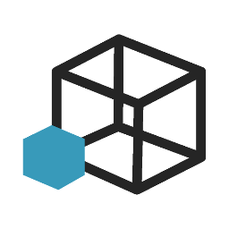
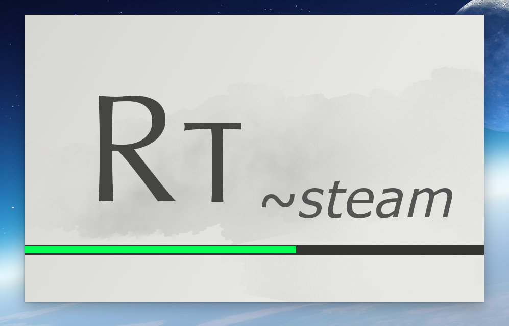
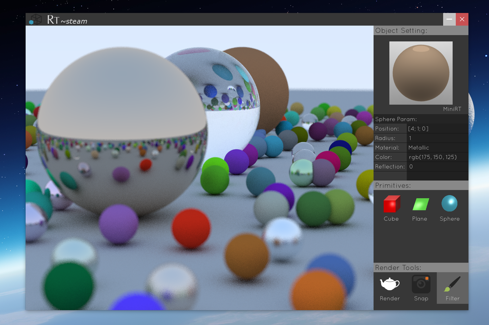
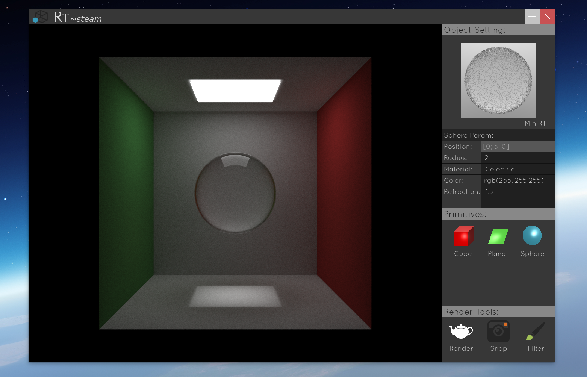
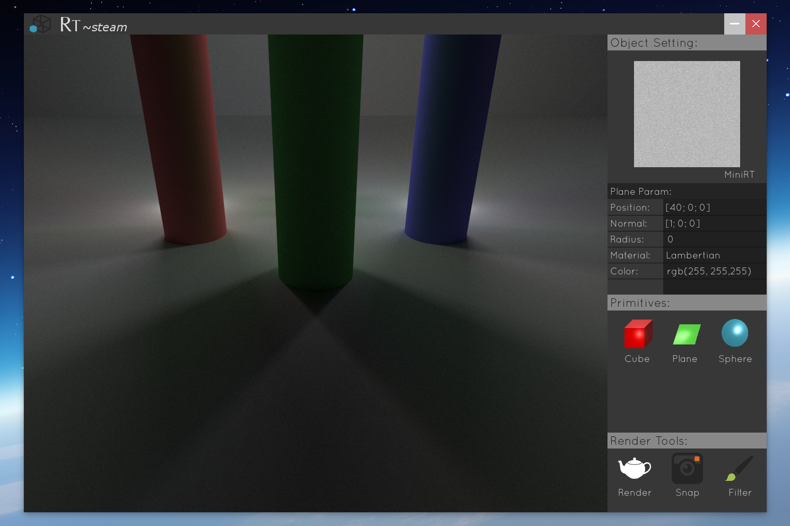

# RT ~steam
RT ~steam is raytracer coded in C using SDL2 and OpenCL. It generates a 3D view out of a given scene file. The parser use a kind of XML file structure, it reads, writes and checks error all at the same time (no double reading). The error system indicates you the line where it fails and the reason why. The parser can itself solve few mistake or apply default values.

Rendering is progressiv based on several passes to be photorealistic... the limit is currently 100. Depending on the scene, rendering can be instant. A full render (100 passes) may takes 5 minutes for simple scene. This process is based on Pixar Renderman system.

- SDL used to manage windows, hook events and draw a pixel on surface;
- Loader for the first initialisation;
- Interface craft from scratch - with a borderless window design;
- Menu and object selecter to get their parameters and modify them in live;
- Simple objects: sphere, plane, cone, cylinder, triangle;
- Complexe objects: paraboloid, ellipsoid; 
- Materials can be applied to any object: Lambert, Metal & Dielectric (reflection and refraction parametable);
- Light and shadowing based on Monte-Carlo algorithm (depending on the material) - Light is a material applyable to any object;
- Global Illumination;
- Objects hold in a placeholder list with function pointers according to type and material;
- Generated Skybox such as gradiant for global illunmination; 
- Anti-aliasing trick with max depth for reflection materials;
- Multisampling x4 set by default;
- Parallelize computing to progressively raytrace a more realistic render while user can input events at same time;
- Multithreading to fastly compute raytracing - threads work on the same algorithm but on different squared aera;
- Ability to move in live with a faster intermediate rendering;
- Some post-processing filters are available too.

### Usage

./rt "file-scene" -options
	Only -w is available for a bigger rendering.

### Compilation

To compile the project, you can either use Code::Block or the Makefile included directly within. Compilation is supported under Mac OS X, Linux and Windows using MinGW (better to compile with Code::Block).
You will need to install these librairies and headers - make sure the path is okay under Code::Block or in the Makefile:

- [SLD 2 - TTF - IMAGE](https://www.libsdl.org/download-2.0.php)
- OpenCL 1.2 (depending on your hardware and OS)

For now you can just avoid OpenCL as it is not still used.

MinGW may also need the [pthreads librairy](http://www.mingw.org/wiki/pthreads_library) installed separetly depending on your installation.

The raytracer use a personal libc provided under libft folder. Makefile just do the job as it should, but you need to recompile libft folder separately when using Code::Block.
We also provided a personnal library of vector in 3 dimensions.

# In Developement

- Options to launch RT;
- Moveable camera based on relative position and not global;
- Debugg materials as function pointers;
- Menu on right to add scene and objects;
- Open CL to use GPU.

# Preview
#### Loader

#### Default Scene

#### The Box

#### Multispot

